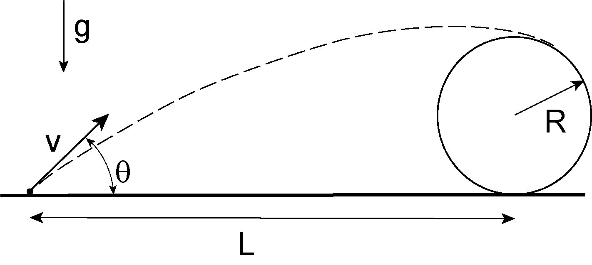

# ClearTheObject
A simulator for the problem: 

Find the velocity of a projectile `V` to clear the object, given `L`, `R`, and $\theta$.

A question I saw in LinkedIn posted by Anindya Chatterjee: [original post](https://www.linkedin.com/feed/update/urn:li:share:6950350158026919936?utm_source=linkedin_share&utm_medium=member_desktop_share&utm_content=post).

